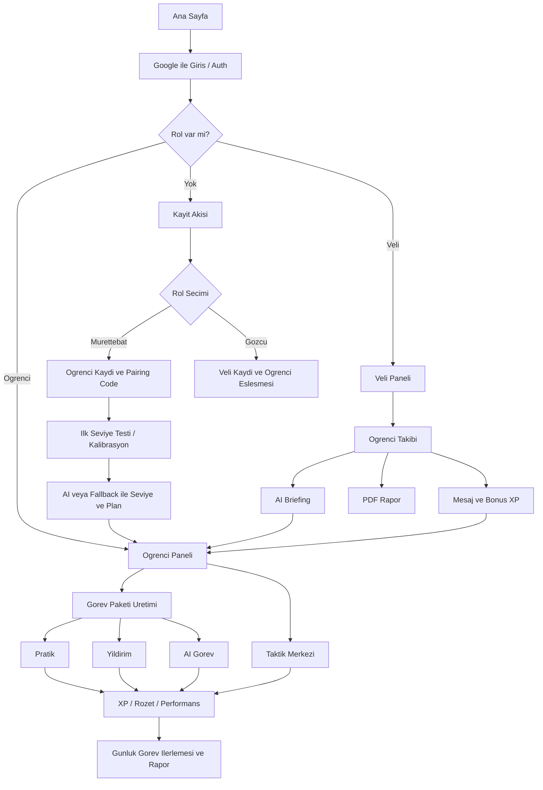

# 🚀 ARF - Türk Uzay Kuvvetleri Akademisi

ARF, matematik eğitimini **Türk Uzay Kuvvetleri (TUK)** temasıyla birleştiren, yapay zeka destekli bir **adaptif öğrenme platformudur**. Öğrenciler (Mürettebat) bir uzay gemisi pilotu olarak matematik görevlerini tamamlarken, veliler (Gözcüler) AI destekli telemetri verileriyle gelişimi takip eder.

## 🌟 Öne Çıkan Özellikler

### 🛡️ Mürettebat (Öğrenci) Deneyimi

- **Dinamik Görev Merkezi:** AI tarafından pilotun seviyesine ve hızına göre her gün yenilenen görev paketleri.
- **Dört Farklı Operasyon Modu:**
  - **Pratik:** Temel işlem yeteneği odaklı.
  - **Yıldırım:** Yüksek basınç altında hız ve refleks.
  - **Görev:** Hikaye tabanlı, AI destekli senaryolar.
  - **Taktikler:** Stratejik problem çözme.
- **Rütbe & Terfi Sistemi:** Toplanan XP'ler ile 10 farklı rütbe ve özel madalyalar.
- **Gemi Garajı:** Kişiselleştirilebilir uzay gemisi renkleri.

### 📡 Gözcü (Veli) Deneyimi

- **Canlı Telemetri:** Pilotun isabet oranı, işlem hızı ve zihinden matematik performansının anlık takibi.
- **DeepSeek AI Analizi:** Pilotun gelişimini analiz eden ve stratejik tavsiyeler sunan yapay zeka briefingleri.
- **Personel Raporu:** Tek tıkla PDF formatında detaylı performans raporu oluşturma.
- **Adaptif Planlama:** Pilotun gelişimine göre AI'dan yeni bir öğrenme yolu talep etme.

## 🛠️ Teknik Stack

- **Frontend:** [Next.js 15](https://nextjs.org/) (App Router)
- **Styling:** [Tailwind CSS v4](https://tailwindcss.com/), [Framer Motion](https://www.framer.com/motion/) (Animasyonlar)
- **Backend:** [Firebase](https://firebase.google.com/) (Auth, Firestore)
- **AI:** [DeepSeek API](https://deepseek.com/) (Brifing ve Strateji üretimi)
- **State Management:** [Zustand](https://zustand-demo.pmnd.rs/)
- **Charts:** [Recharts](https://recharts.org/)
- **Reporting:** [jsPDF](https://github.com/parallax/jsPDF)

## 📁 Proje Yapısı

```bash
├── app/                  # Next.js Sayfa ve API Rotaları
│   ├── api/              # AI ve Sistem API uç noktaları
│   ├── ogrenci/          # Mürettebat dashboard ve görev odaları
│   └── veli/             # Gözcü paneli ve ayarlar
├── components/           # UI Bileşenleri (ArfLogo, Stars, Chart vb.)
├── lib/                  # Çekirdek Mantık (Commander AI, Firebase, Missions)
├── hooks/                # Özel React Hook'ları
└── public/               # Statik Varlıklar
```

## 🧭 Uygulama Akışı

ARF'nin uçtan uca sistem akışı için detaylı teknik doküman:

- [FLOW.md](/mnt/d/arf/FLOW.md)
- [Excalidraw diyagramı](/mnt/d/arf/arf-full-flow-2026-04-23.excalidraw)

### Genel Akış Özeti



### Adım Adım

1. Kullanıcı ana sayfadan Google ile giriş yapar.
2. Sistem kullanıcıyı mevcut rolüne göre öğrenci veya veli paneline yönlendirir.
3. Yeni kullanıcıysa kayıt akışı başlar:
   - Öğrenci için `pairingCode` üretilir.
   - Veli için mevcut öğrenci koduyla eşleşme yapılır.
4. Öğrenci ilk girişte seviye tespit kalibrasyonunu tamamlar.
5. Sistem öğrencinin metriklerine göre seviye, öğrenme yolu ve çalışma planı üretir.
6. Öğrenci dashboard açıldığında günlük görev paketi hazırlanır.
7. Öğrenci farklı görev modlarında oynar:
   - Pratik
   - Yıldırım
   - AI Görev
   - Taktik Merkezi
8. Her görev sonunda XP, badge, performans ve görev ilerleme verileri güncellenir.
9. Veli paneli bağlı öğrencileri izler, AI briefing alır, mesaj gönderir ve PDF rapor üretir.
10. Öğrencinin gelişimine göre sistem planı zamanla yeniden değerlendirir.

## 🚀 Kurulum

1. Bağımlılıkları yükleyin:

   ```bash
   npm install
   ```

2. `.env.local` dosyasını oluşturun ve gerekli anahtarları ekleyin:

   ```env
   NEXT_PUBLIC_FIREBASE_API_KEY=your_key
   DEEPSEEK_API_KEY=your_key
   ```

3. Geliştirme sunucusunu başlatın:

   ```bash
   npm run dev
   ```

## Coolify Deploy

Bu repo Coolify ile `docker-compose.yml` üzerinden deploy edilmeye hazırdır.

1. Repoyu GitHub'a push edin.
2. Coolify'da `Docker Compose` tabanlı yeni bir kaynak oluşturun.
3. Domain olarak `https://arf.erkanerdem.net` tanımlayın.
4. Coolify dashboard içinde gerekli environment variable'ları girin.
5. Container port olarak `3000` kullanın.

Temel dosyalar:

- `Dockerfile`: Next.js production image
- `docker-compose.yml`: Coolify servis tanımı
- `.env.example`: dashboard'a girilecek örnek env anahtarları

## 📜 Lisans

Bu proje ARF Yazılım ve Eğitim Teknolojileri kapsamında geliştirilmiştir. Tüm hakları saklıdır.
